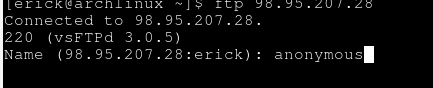
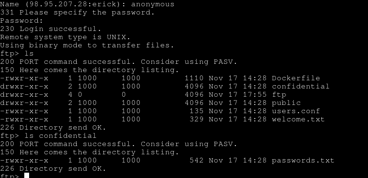
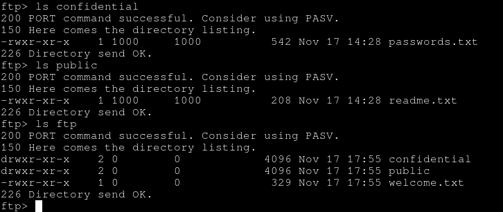
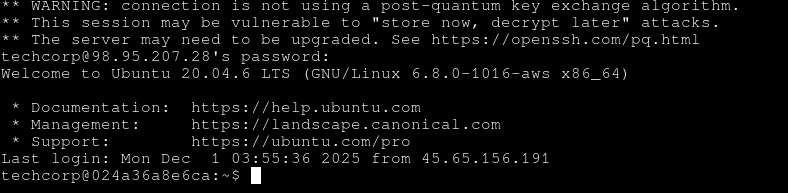
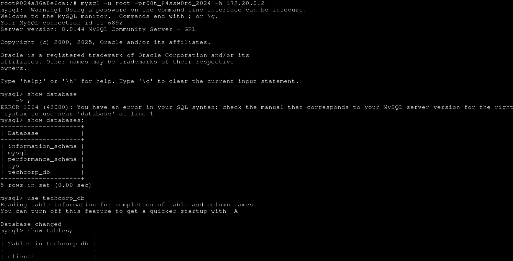
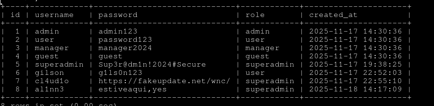
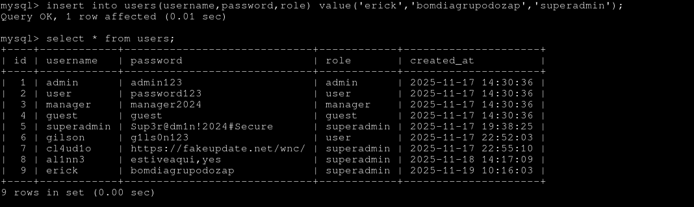
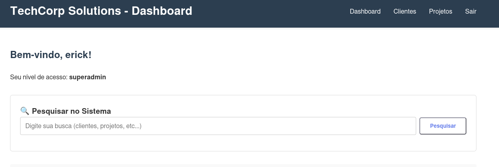
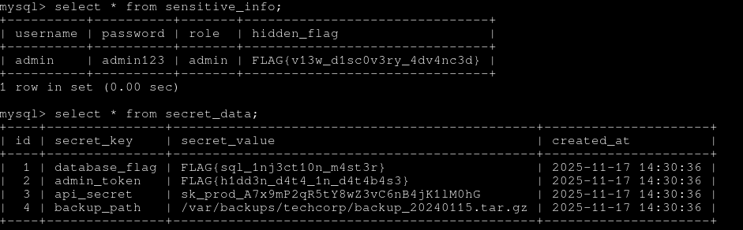
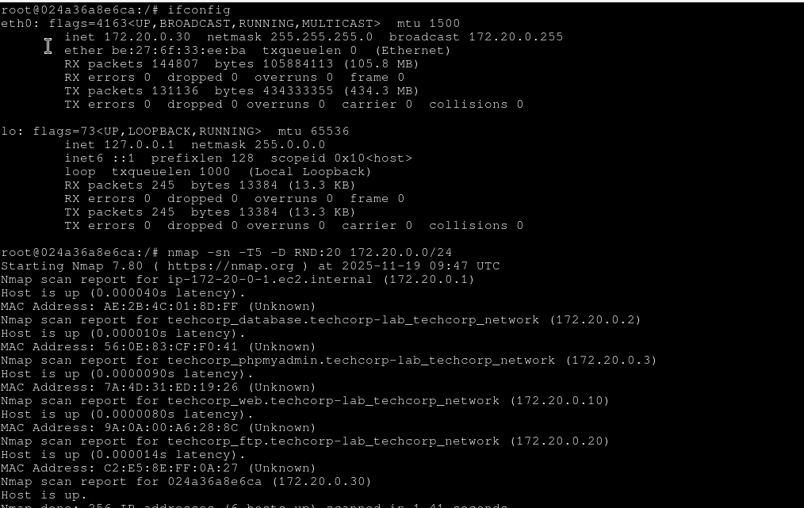

**Autor:** Erick Menezes
**Data:** 30/11/2025 
**Versão:** 1.0 
**Repositório:** https://www.github.com/erickmnz/recon-simulado
## Sumário Executivo

Foi realizada uma avaliação de segurança em um serviço web simulado hospedado em ambiente de laboratório. Durante o exercício foram identificadas múltiplas exposições e más configurações que permitem descoberta de arquivos sensíveis, acesso a FTP público, enumeração de serviços via Nmap, acesso SSH e extração de segredos armazenados em banco de dados. Foram encontradas evidências em `robots.txt`, diretórios de backup e arquivos de configuração que indicam risco de divulgação de dados e credenciais. Recomenda-se correções imediatas em autenticação, controle de acesso e isolamento de serviços.

## Objetivo

Avaliar a superfície de ataque do serviço web simulado para identificar exposições, dados sensíveis e vetores de escalonamento de privilégio.

## Escopo

Ambiente web simulado contendo serviços web, FTP, SSH e banco de dados em hosts internos identificados na varredura.

## Metodologia

- **Ferramentas:** `nmap`, `nikto`, `gobuster`, clientes FTP/SSH, consultas SQL manuais
    
- **Atividades:** varredura de portas, enumeração de diretórios, leitura de `robots.txt`, conexão FTP, tentativa de SSH, inspeção de arquivos de configuração e extração de segredos do banco de dados
    
- **Horários relevantes:** varredura iniciada às **20:00**; conexão FTP às **20:17**; acesso SSH às **20:32**
    

## Achados Detalhados

### robots.txt e descoberta inicial

- **Conteúdo relevante encontrado em** `robots.txt`**:**
    
    - `Disallow: /admin/`
        
    - `Disallow: /backup/`
        
    - `Disallow: /.git/`
        
    - `Disallow: /config/`
        
    - **Flag descoberta:** `FLAG{r0b0ts_txt_l34k4g3}`
        
    - **Observação:** `robots.txt` revela caminhos sensíveis e aponta para arquivo de backup em `/backup/database_backup_2024.sql`.
        

### Serviço FTP 

- **Comportamento:** FTP acessível por acesso anônimo; listagem de diretórios disponível
    
- **Arquivos e diretórios listados:** `Dockerfile`; `confidential/`; `ftp/`; `public/`; `users.conf`; `welcome.txt`
    
- **Permissões e metadados:** arquivos com permissões `-rwxr-xr-x` e diretórios com proprietário UID 1000 e root em alguns itens
    
- **Flags e strings encontradas em arquivos de configuração:**
    
    - `# FLAG{c0nf1g_f1l3_r34d}`
        
    - `FLAG{p4ssw0rd_f1l3_d1sc0v3ry}`
        
    - `FLAG{ftp_4n0nym0us_4cc3ss}`
        
- **Avaliação:** FTP totalmente exposto presença de diretórios `confidential` e `backup` representa risco de vazamento.

	`
	
	
*  **Arquivos achados no servidor ftp:**
	  
	 
	
	 
	
### Acesso SSH e Banco de Dados 

- **Acesso SSH obtido:** sessão interativa permitiu navegação no sistema e acesso a arquivos locais, acesso ao banco de dados e inserção de usuário superadmin no painel do site.
    
- **Evidências de exploração de banco de dados:** extração de tabela contendo segredos

- **Escalada de privilégios:** consegui escalar privilégios apenas com a senha vazada do techcorp. 

- **Flags adicionais encontradas no sistema:**
    
    - `FLAG{ssh_h0m3_d1r3ct0ry_3xpl0r4t10n}`
        
    - `FLAG{v13w_d1sc0v3ry_4dv4nc3d}`
        
    - `FLAG{d4t4b4s3_cr3d3nt14ls_3xp0s3d}`
        
- **Observação:** presença de `api_secret` e caminhos de backup indicam risco de comprometimento de dados em produção se reutilizados.

- **Arquivos relevantes encontrados no servidor ssh:**
	
### Serviços e Hosts identificados via Nmap

- **Resumo da varredura Nmap:** 6 hosts ativos identificados na rede de laboratório
    
- **Hosts relevantes:**
    

|Host|IP|Observação|
|---|---|---|
|Gateway local|172.20.0.1|Host up|
|Database container|172.20.0.2|Serviço de banco de dados identificado|
|phpMyAdmin container|172.20.0.3|Interface de administração web do BD|
|Web application|172.20.0.10|Serviço web principal|
|FTP container|172.20.0.20|Serviço FTP acessível|
|Host adicional|172.20.0.30|Container/host visível|

- **Nmap:** varredura rápida de 256 IPs retornou 6 hosts up; latências muito baixas indicam ambiente local de containers.
    

## Riscos Identificados

- **Exposição de backups e arquivos sensíveis** via `robots.txt` e diretórios públicos.
    
- **FTP com conteúdo confidencial** acessível sem controles adequados.
    
- **Segredos em banco de dados** (tokens, chaves de API, caminhos de backup) armazenados sem criptografia.
    
- **Acesso SSH obtido** permite movimentação e extração de dados.
    
- **Possível vulnerabilidade XSS refletida** indicada por cookie codificado com flag.
    
- **Presença de arquivos de configuração e** `.git` **potencialmente acessíveis** aumenta risco de leak de código e credenciais.
    

## Recomendações Imediatas

- **Remover ou restringir** `robots.txt` para não expor caminhos sensíveis; mover backups para local inacessível via web.
    
- **Isolar e proteger FTP:** desabilitar acesso anônimo, aplicar autenticação forte, restringir por IP e criptografar informações importantes, como senhas.
    
- **Rotacionar segredos:** invalidar e rotacionar `api_secret`, `admin_token` e quaisquer credenciais encontradas.
    
- **Remover arquivos sensíveis do repositório público** e proteger `.git` e `/config`.
    
- **Hardening no SSH:** desabilitar autenticação por senha, usar chaves, restringir usuários e registrar sessões.
    
- **Criptografar segredos em banco de dados** e aplicar controle de acesso baseado em privilégios mínimos.
    
- **Rever logs e auditoria** para identificar possíveis acessos não autorizados.
    

## Plano de Ação Prioritário (80/20)

|Ação|Impacto|Facilidade|Prioridade|
|---|---|---|---|
|Rotacionar segredos expostos|Alto|Média|Alta|
|Restringir acesso a backups e `/config`|Alto|Alta|Alta|
|Desabilitar FTP público / aplicar autenticação|Alto|Média|Alta|
|Remover dados sensíveis de repositórios públicos|Alto|Média|Alta|
|Harden SSH e revisar contas|Alto|Média|Alta|

## Conclusão

O serviço web simulado apresenta exposições críticas e práticas inseguras de armazenamento de segredos que permitem descoberta e extração de dados sensíveis. A combinação de arquivos de backup acessíveis, FTP público e segredos em banco de dados facilita comprometimento em ambiente real. Recomenda-se executar as correções listadas com prioridade alta, realizar nova varredura após mitigação e implementar monitoramento contínuo.

## Redes e Hosts Identificados

|Rede Estimada|Subnet|Finalidade Suposta|
|---|---|---|
|lab_net|172.20.0.0/24|Ambiente de containers e serviços simulados|

### Hosts por função

| IP          | Função estimada        | Evidência                                                          |
| ----------- | ---------------------- | ------------------------------------------------------------------ |
| 172.20.0.1  | Gateway/container host | Nome `ec2.internal` detectado                                      |
| 172.20.0.2  | Database               | Nome `techcorp_database` detectado; Banco de dados acessível       |
| 172.20.0.3  | phpMyAdmin             | Nome `techcorp_phpmyadmin` detectado; Acessível através do browser |
| 172.20.0.10 | Web app                | Nome `techcorp_web` detectado                                      |
| 172.20.0.20 | FTP                    | Nome `techcorp_ftp` detectado; FTP acessível                       |
| 172.20.0.30 | Host adicional         | Servidor SSH que loguei                                            |

## Observações Finais de Risco

- **Alta prioridade:** rotacionar segredos, proteger backups, criptografar senhas e banco de dados.
    
- **Média prioridade:** revisar exposição de diretórios e arquivos estáticos.
    

